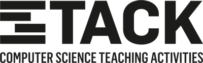

 

---

# The Stack of Activities for Teaching Computer Science

Teaching computer science with abstract lectures? Boring! We prefer active learning methods. That's why we created the Stack: an open-source collection of teaching activities for understanding and practicing CS concepts.

Each activity in the Stack features a thorough description, printable handouts, and supporting materials for teachers to easily use in their classes. For free.

## Activities

You can browse [the full list of activities](activities.md). Or just have a quick look at our **flagship activities**:

* [Code puzzle](activities/code-puzzle) -- An advanced Parson's problem in C\#.
* [Encryption modes](activities/encryption-modes) -- Learn block cipher modes of operation, their properties and use cases from scratch.
* [Incident handling: A suspicious e-mail](activities/incident-handling-suspicious-email) -- Spot an e-mail scam within a corporate scenario that really happened.

## Knowledge base

* [Why assign activities](knowledge-base/why-to-assign-activities.md) -- Motivation for using activities in teaching.
* [How to assign activities](knowledge-base/how-to-assign-activities.md) -- Assigning tasks in a way that results in action.
* [External resources](knowledge-base/references.md) -- Useful links to websites relevant for teaching CS.
* [Meta-Stack](https://github.com/teaching-lab/stack-cs-teacher-training) -- Activities for training computer science teachers.

## Contact us and join our efforts

Feel free to contribute your own activities. Please, read the [contribution guidelines](CONTRIBUTING.md), format your submission accordingly, and we'll gladly welcome it in the Stack! For example, you can start by developing the [ideas for new activities](activities-wip/ideas.md).

We also appreciate suggestions for improvement, notes on your experience, or any other comments.
Please, email us at *teachinglab@fi.muni.cz*.

## Contributing authors

The Stack was conceived and is maintained by [Valdemar Švábenský](https://www.fi.muni.cz/~xsvabens/), a member of the [*Teaching Lab*](https://is.muni.cz/predmet/fi/DUCIT) community at the [Faculty of Informatics, Masaryk University](https://fi.muni.cz).

However, the Stack wouldn't exist without the significant contributions of other Teaching Lab members, especially Martin Ukrop, who laid the foundations with his awesome Encryption modes activity, and Ondráš Přibyla, who shared his great teaching experience with us.

A big 'thank you' goes to the authors of the activities (in alphabetical order): Bibiána Ťureková, CSIRT-MU team, Jakub Žák, Jan Horáček, Jaroslav Čechák, Karel Kubíček, Lukáš Daubner, Martin Macák, Martin Ukrop, Matej Troják, Michaela Pokludová, Phillip Abramson, Radka Cieslarová, and Vlasta Šťavová.

Finally, thanks to [Waldemarski](http://www.waldemarski.com/) for creating the logotype.

## License

This work is licensed under a [Creative Commons Attribution-NonCommercial-ShareAlike 4.0 International License](https://creativecommons.org/licenses/by-nc-sa/4.0/). When using an activity, please credit "Teaching Lab, Faculty of Informatics, Masaryk University".
