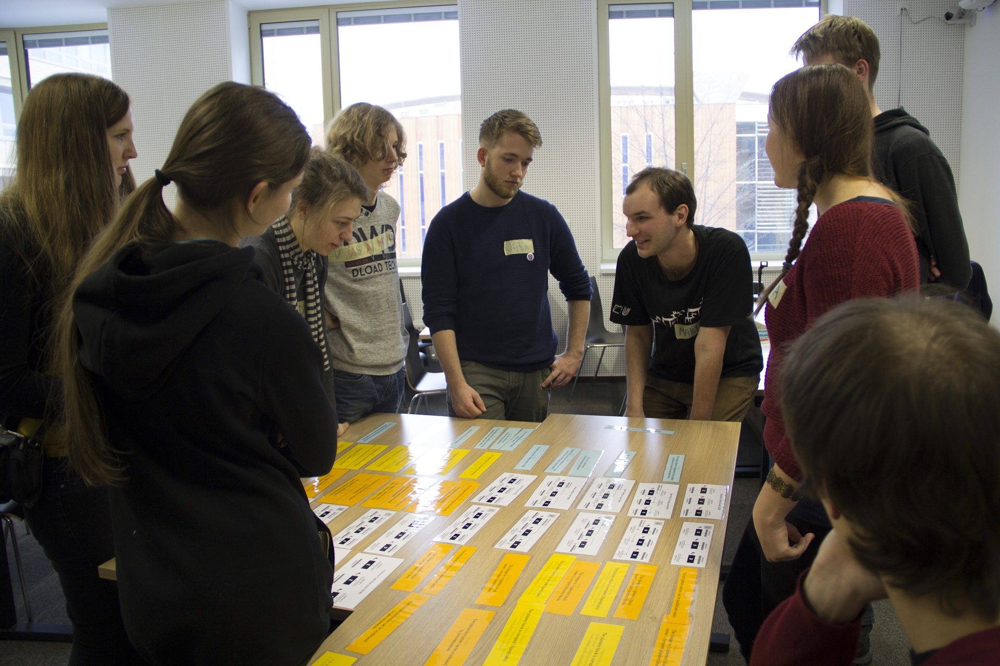

# Encryption modes

Hands-on team activity for understanding block cipher modes of operation. From motivation, via getting to know the principles, reasoning about features to justifying appropriate use cases. Based on matching given paper tiles and discussing within and between groups.

| Parameters:        |                                     |
| -----------------: | :---------------------------------- |
| **Duration:**      | 90 minutes                          |
| **Participants:**  | 6–30 students                       |
| **Instructors:**   | 1–X teachers (ideally 1 per 6-8 participants)    |
| **Class:**         | table for each group, projector                  |
| **Resources:**     | printed activity tiles, intro presentation       |
| **Prerequisites:** | understanding XOR, intuition of using encryption |

## Learning outcomes

* Understand the need for encryption modes (i.e., why ECB is not sufficient).
* Know multiple modes of operation, their principles, benefits, and drawbacks.
* Justify selection of the appropriate mode for selected use cases.

## Setup and preparation

* Go over the [introductory presentation](slides.pdf) and adjust it to your needs (add/remove info according to what your students know). 
* Print the set of [paper cards](cards.pdf) for each group.
  * Use one-sided printing.
  * If possible, print on paper of 3 different colors: encryption & decryption schemes on the first, features on the second and use cases on the third. This will help both you and the students.
  * Cut the pages into individual cards. If you plan to repeat the activity, you can laminate the cards.
  * On some pages, there are extra cards – if printing for multiple groups, some combinatory analysis can save you paper.
* Print an [answer table](key.pdf) for each instructor.
* If you need it, there are editable formats in the [source folder](sources).

## Activity overview

* Motivation ([introductory presentation](slides.pdf))
  * Go over the motivational presentation with the group. Let the participants figure out every step themselves (e.g., letting them figure out we'll split the plaintext, use the cipher multiple times).
  * Emphasize we presume the key is fixed for the whole activity.
  * Make sure they understand how bitwise XOR works and what properties it has (e.g., XORing with the same string twice results in the plaintext).
* Division into groups
  * Let people divide into groups of 3–4 people each as they see fit.
* Encryption schemes ([scheme cards with mode names](cards.pdf))
  * Give cards with encryption schemes to each group.
  * Task for the group: *Go over the schemes, identify differences, find out if you understand the notation.*
  * If necessary, explain the schematics, field coloring, XOR, nonce, counter and string concatenation.
* Decryption schemes ([scheme cards with letters](cards.pdf))
  * Give cards with decryption schemes to each group.
  * Task for the group: *Match the decryption schemes to corresponding encryption schemes.*
* Mode features ([feature cards](cards.pdf))
  * Give basic feature cards to each group.
  * Task for the group: *Assign the given features to the encryption modes. If a feature applies to multiple modes, you have it multiple times.*
  * After the group reads the features, make sure they understand all of them.
  * If time and knowledge permits, give out bonus features after matching the basic ones. After the group reads them, make sure they understand them fully. (Don't underestimate these, they are much more complicated than the basic.)
* Real-world use cases ([use case cards](cards.pdf))
  * Give each group a set of cards with real-world use cases.
  * Task for the group: *Choose the appropriate mode for the given use cases and justify your selection.*
  * It may be worth noting to the participants that there are no "correct" answers now (it all stands on the justification). Opinions of the author are summarized below.
    * voting: ECB/CBC (ECB is simple and sufficient, but CBC is less error-prone for extensions)
    * video: CRT/OFB (CRT is much more common than OFB)
    * embedded system, IM, settings encryption: probably CBC (it's a de facto standard)
    * backups: neither of given modes is very good (ideally XTS or other modes)
* Group discussion
  * Have pairs of groups compare their selection of encryption modes for the given use cases. Let them justify their choice to the other group. (Experience: Start with discussing the 'video' use case.)
  * If there are enough instructors, keep one instructor with each pair of groups.
  * When relevant or asked for, offer your own opinion or extra information.
* Conclusion
  * Mention related material (especially AES in pictures)
  * Optionally summarize the activity and have participants reflect what they have learned.

## Tips and tricks

* Once the groups form, work with them individually if there are enough instructors (there is no need to have them perfectly synchronized). If some groups are much faster than other, give them advanced features (and don't give them to the slower groups).
* If possible convince groups that they want to use the table (as opposed to laying cards on the floor). The full matching takes quite a lot of space (and working on the floor for long tends to become uncomfortable).
* Before giving a new set of cards to a group, check their matching according to the [answer table](key.pdf). If enough time, have them correct their own mistake instead of pointing it out straight away.
* The activity does not require previous knowledge of cryptography (intuition will often do). The activity worked well for smart secondary school students (they just needed to understand XOR).
* Group size is up to your choice, but 3–4 people turned out best (enough for discussion but still keeping everyone engaged).
* The activity will progress faster with skilled participants and slower with less skilled ones.
* The conclusion can be done together for everybody or have each group pair with an instructor conclude independently (in such case, synchronize rough ending).

## Related material

* If you are interested in how the block cipher black box works, see for example [A Stick Figure Guide to the Advanced Encryption Standard (AES)](http://www.moserware.com/2009/09/stick-figure-guide-to-advanced.html)
* Ange Albertini has a beautiful illustration of [modes of operation's failures](https://raw.githubusercontent.com/corkami/pics/master/binary/CryptoModes.png) and an intriguing [AES crypto-binary magic trick](https://speakerdeck.com/ange/when-aes-equals-episode-v). More stuff from Ange (reverse engineering, binary stuff, crypto, visualizations) can be found at [Corkami GitHub](https://github.com/corkami) or [Speaker Deck](https://speakerdeck.com/ange).
* For generating your own hi-res ECB penguin (or pop-art thereof), see for example the [blog post tutorial](https://blog.filippo.io/the-ecb-penguin/) by Filippo Valsorda.

## Author

Created by Martin Ukrop in 2016.

## Activity photo

 

Students are evaluating the completed exercise with the teacher.
Photo by Róbert Tamáš, 2017.